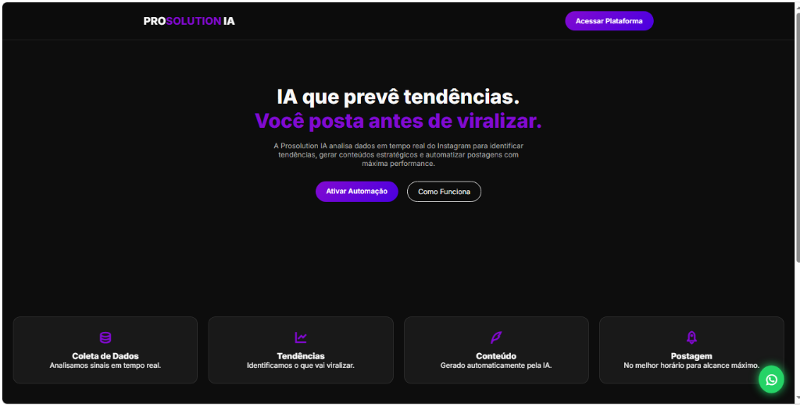

# 🚀 Prosolution IA — SaaS Oficial de Automação & Inteligência Artificial

A **Prosolution IA** é uma plataforma **SaaS Backend-First**, desenvolvida em **FastAPI**, com foco em **alta segurança, escalabilidade assíncrona e orquestração inteligente de publicações e pagamentos**.



> ⚡ **Status do Projeto**: Em desenvolvimento ativo contínuo (Atualizado em **Agosto de 2026**). Arquitetura refatorada, sem dados de demonstração ou segredos hardcoded.

---

## 💎 Destaques da Versão Oficial

* **🎨 Novo Dashboard Oficial**: Interface Dark Mode de alto contraste com glassmorphism, sem dados estáticos ou falsos.
* **🔒 Segurança Rígida (P0)**:
  * Autenticação via **Bcrypt Nativo** e tokens **JWT (python-jose)** com cookies `HttpOnly`, `SameSite=Lax` e `Secure`.
  * `SECRET_KEY` e chaves de API sem fallbacks públicos (carregadas exclusivamente via `.env`).
  * Rotas sensíveis e Dashboard 100% protegidos por dependências de injeção direta.
* **⚡ SQLAlchemy Assíncrono + Alembic**: Migrações automatizadas e modelos estruturados para Usuários, Posts, Pagamentos e Logs de IA.
* **💳 Gateway Pix (Mercado Pago)**: Arquitetura com persistência decimal segura (`Numeric(10,2)`).
* **🤖 Multi-Provider de IA**: Orquestração integrada para Google Gemini e OpenAI.

---

## 🛠️ Stack Tecnológica

* **Linguagem**: Python 3.11+ / 3.13
* **Framework**: FastAPI (Async)
* **Banco de Dados**: SQLAlchemy 2.0 (Async) + Alembic + SQLite (Local) / PostgreSQL (Produção)
* **Segurança**: Bcrypt + JWT (python-jose) + Pydantic Settings
* **Frontend**: HTML5 + Jinja2 + Vanilla CSS + Google Fonts (Outfit)
* **Servidor**: Uvicorn ASGI

---

## 📂 Estrutura Consolidada

```text
app/
├── ai/            # Provedores de IA (Gemini, OpenAI) e rotas
├── auth/          # Endpoints de Login e Registro com JWT
├── core/          # Configurações Pydantic e segurança
├── dashboard/     # Métricas reais e renderização de tela
├── database/      # Modelos oficiais, sessões assíncronas e Alembic
├── instagram/     # Publicação e automação de mídias
├── payments/      # Integração Pix via Mercado Pago
├── users/         # Modelos e repositórios de usuários
├── security.py    # Módulo centralizado de hash e tokens
└── main.py        # Ponto de entrada da aplicação FastAPI
```

---

## 🚀 Como Executar Localmente

### 1. Clonar o Repositório
```bash
git clone https://github.com/Eduardo09e32y4rhf/Api-prosolution.git
cd Api-prosolution
```

### 2. Configurar o Ambiente Virtual
```bash
python -m venv venv
venv\Scripts\activate   # Windows
# source venv/bin/activate  # Linux/Mac
```

### 3. Instalar Dependências
```bash
pip install -r requirements.txt
```

### 4. Configurar Variáveis de Ambiente
Copie o modelo de `.env.example` e adicione seus tokens:
```bash
cp .env.example .env
```

### 5. Executar Migrações do Banco
```bash
alembic upgrade head
```

### 6. Iniciar a Aplicação
```bash
uvicorn app.main:app --port 3000 --reload
```

Acesse no navegador:
👉 **[http://127.0.0.1:3000](http://127.0.0.1:3000)**

---

## 👨‍💻 Autor & Manutenção

**José Eduardo da Silva**  
🎓 Análise e Desenvolvimento de Sistemas  
💻 Backend Developer & AI Architect  
🔗 [GitHub: @Eduardo09e32y4rhf](https://github.com/Eduardo09e32y4rhf)
